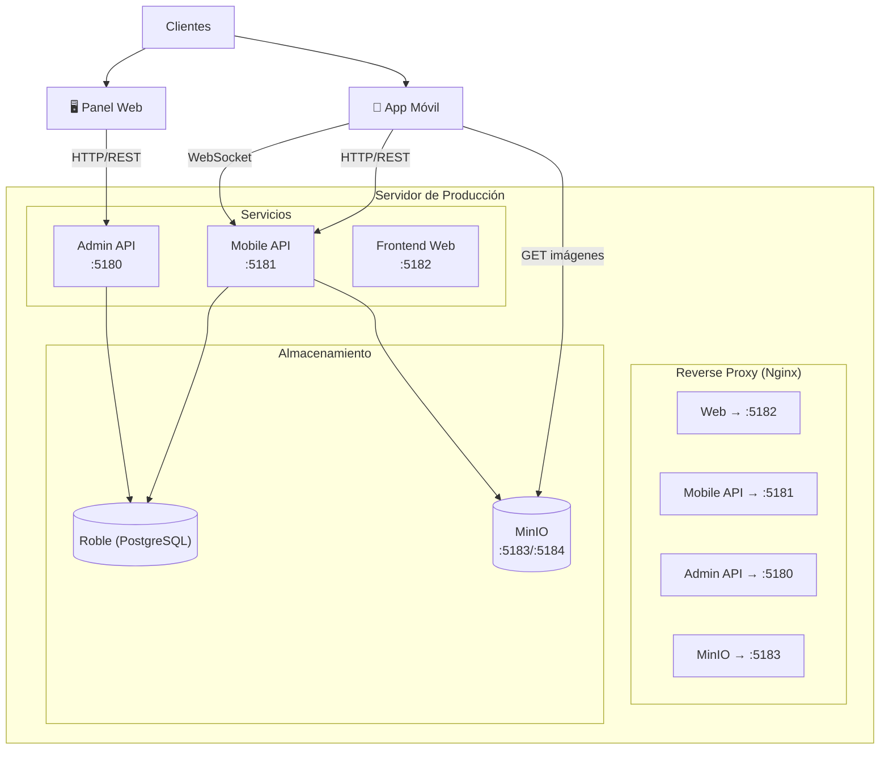
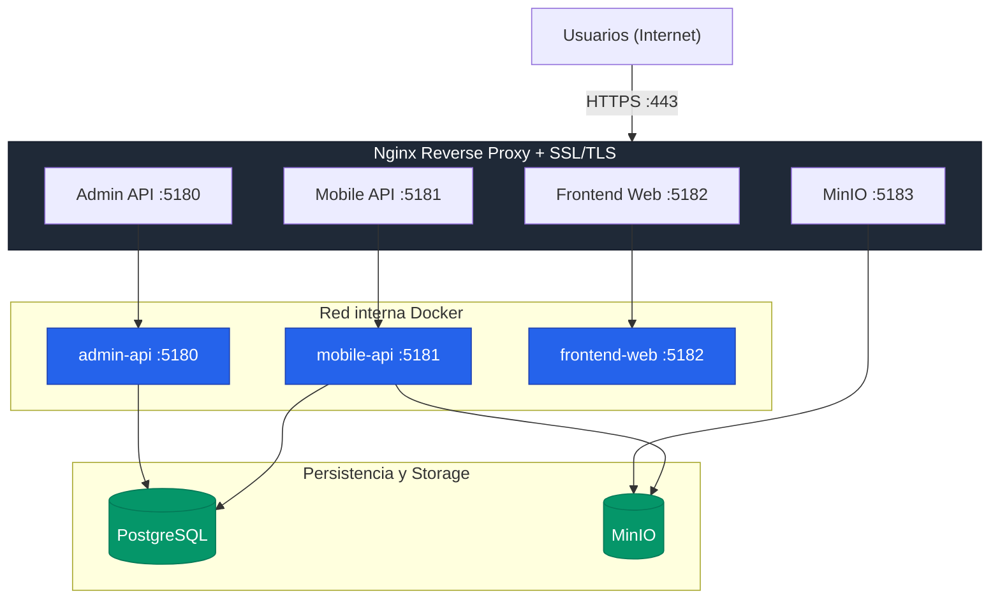

# Guía de Instalación y Despliegue — NewLife

## Tabla de Contenidos

- [1. Descripción General de la Solución](#1-descripción-general-de-la-solución)
- [2. Requisitos Previos](#2-requisitos-previos)
- [3. Instalación para Ambiente de Desarrollo](#3-instalación-para-ambiente-de-desarrollo)
  - [3.1 Desarrollo SIN Contenedores](#31-desarrollo-sin-contenedores)
  - [3.2 Desarrollo CON Contenedores](#32-desarrollo-con-contenedores)
- [4. Despliegue a Ambiente de Producción](#4-despliegue-a-ambiente-de-producción)
  - [4.1 Arquitectura de Despliegue](#41-arquitectura-de-despliegue)
  - [4.2 Proceso General de Actualización](#42-proceso-general-de-actualización)
  - [4.3 Despliegue SIN Contenedores](#43-despliegue-sin-contenedores)
  - [4.4 Despliegue CON Contenedores](#44-despliegue-con-contenedores)
- [5. Verificación de Funcionamiento](#5-verificación-de-funcionamiento)
- [6. Solución de Problemas Frecuentes](#6-solución-de-problemas-frecuentes)
- [7. Mantenimiento y Actualización](#7-mantenimiento-y-actualización)
- [8. Referencias Relacionadas](#8-referencias-relacionadas)

---

## 1. Descripción General de la Solución

### 1.1 Lenguajes y Tecnologías Principales

NewLife está desarrollado íntegramente en **TypeScript**. Los frameworks y versiones recomendadas son:

| Tecnología | Versión | Componente |
|---|---|---|
| Node.js | **20.x LTS** | Backend (NestJS) y build del frontend web |
| TypeScript | **5.x** | Todo el proyecto |
| React Native | **0.83.6** | App móvil |
| Expo CLI | **~55.0.24** | Desarrollo y build de la app móvil |
| Next.js | **16.1.6** | Panel de administración web |
| NestJS | **10.4.x / 11.0.x** | APIs backend |
| Docker | **24.x o superior** | Contenedores (opcional pero recomendado) |
| Docker Compose | **v2.x** | Orquestación de contenedores |

⚠️ **Importante**: Usar versiones de Node.js anteriores a la 18 puede causar incompatibilidades con las dependencias de NestJS y Next.js. Se recomienda Node.js 20 LTS.

### 1.2 Componentes Principales de la Solución

| Componente | Tecnología | Función en el sistema |
|---|---|---|
| **App Móvil** | React Native / Expo | Interfaz para usuarios finales en proceso de recuperación |
| **Panel Web Admin** | Next.js | Dashboard para profesionales de salud que gestionan contenidos |
| **Mobile API** | NestJS 10 | Backend REST + WebSocket para la app móvil (puerto 5181) |
| **Admin API** | NestJS 11 | Backend REST para el panel administrativo (puerto 5180) |
| **MinIO** | MinIO (S3-compatible) | Almacenamiento de imágenes y archivos de audio (puerto 5183) |
| **Base de Datos** | PostgreSQL via Roble UN | Persistencia de todos los datos del sistema |

### 1.3 Arquitectura General



---

## 2. Requisitos Previos

### 2.1 Software Requerido

Verificar que el siguiente software está instalado antes de comenzar:

| Software | Versión mínima | Cómo verificar |
|---|---|---|
| **Git** | 2.x | `git --version` |
| **Node.js** | 20.x LTS | `node --version` |
| **npm** | 9.x | `npm --version` |
| **Docker** | 24.x | `docker --version` |
| **Docker Compose** | v2.x | `docker compose version` |

Para la app móvil, adicionalmente:
| Software | Versión mínima | Cómo verificar |
|---|---|---|
| **Android Studio** | Latest stable | Abre Android Studio correctamente |
| **Android SDK** | API 33+ | En Android Studio → SDK Manager |
| **Java (JDK)** | 17 | `java -version` |
| **Expo CLI** | Latest | `npx expo --version` |

**Instalación de Node.js 20** (si no está instalado):

En **Windows**: Descargar el instalador desde [nodejs.org](https://nodejs.org) seleccionando la versión 20 LTS.

En **Linux (Ubuntu/Debian)**:
```bash
curl -fsSL https://deb.nodesource.com/setup_20.x | sudo -E bash -
sudo apt-get install -y nodejs
```

En **macOS**:
```bash
brew install node@20
```

### 2.2 Requisitos Opcionales

| Software | Propósito |
|---|---|
| **Docker Desktop** (Windows/Mac) | Interfaz gráfica para gestionar contenedores |
| **VS Code** | Editor recomendado; extensiones: ESLint, Prettier, Docker |
| **Postman / Insomnia** | Probar endpoints de las APIs |
| **Android Emulator** (vía Android Studio) | Probar la app móvil sin dispositivo físico |
| **Expo Go** (app en dispositivo) | Probar la app móvil en dispositivo real sin build completo |

### 2.3 Variables de Entorno Necesarias

Antes de ejecutar el proyecto necesitarás los valores para las siguientes variables críticas. Solicítalas al equipo:

- `ROBLE_PROJECT_TOKEN` — Token del proyecto en Roble UN
- `ROBLE_SYSTEM_EMAIL` / `ROBLE_SYSTEM_PASSWORD` — Credenciales de acceso a Roble
- `ADMIN_JWT_SECRET` — Secreto para JWT de administradores (generar uno seguro para producción)
- Credenciales de MinIO (`MINIO_ROOT_USER`, `MINIO_ROOT_PASSWORD`, `MINIO_ACCESS_KEY`, `MINIO_SECRET_KEY`)

### 2.4 Requisitos de Hardware Recomendados

| Recurso | Mínimo | Recomendado |
|---|---|---|
| **RAM** | 8 GB | 16 GB |
| **Almacenamiento** | 20 GB libres | 40 GB libres |
| **CPU** | 4 cores | 8 cores |
| **OS** | Linux, macOS, Windows 10+ | Linux Ubuntu 22.04 LTS |

⚠️ Para desarrollo con Docker + emulador Android simultáneamente, se recomienda fuertemente tener 16 GB de RAM, ya que el emulador por sí solo consume 4-6 GB.

---

## 3. Instalación para Ambiente de Desarrollo

### 3.1 Desarrollo SIN Contenedores

Esta opción ejecuta cada servicio directamente en tu máquina, sin Docker. Requiere más configuración inicial pero ofrece mayor flexibilidad para depurar.

#### 3.1.1 Clonar el Repositorio

```bash
# Clonar el repositorio en tu máquina local
git clone https://github.com/openlabun/NewLife.git NewLife

# Entrar al directorio del proyecto
cd NewLife

# Verificar que estás en la rama correcta (main para desarrollo)
git status
git checkout main
```

#### 3.1.2 Instalar Dependencias

Cada componente tiene sus propias dependencias. Instalarlas por separado:

```bash
# Dependencias del panel web
cd frontend/web
npm install
cd ../..

# Dependencias del Mobile API
cd backend/mobile-api
npm install
cd ../..

# Dependencias del Admin API
cd backend/admin-api
npm install
cd ../..

# Dependencias de la app móvil
cd frontend/mobile
npm install
cd ../..
```

> 💡 **Nota**: La instalación puede tardar 3-10 minutos por componente dependiendo de la velocidad de tu conexión a internet y la velocidad del disco.

#### 3.1.3 Configurar Variables de Entorno

```bash
# Desde la raíz del proyecto
# Si existe .env.example, copiarlo:
copy .env.example .env        # Windows
# cp .env.example .env        # Linux/Mac

# Editar el archivo .env con tus valores reales
notepad .env                  # Windows
# nano .env o code .env       # Linux/Mac
```

Configurar al menos las siguientes variables en `.env`:
```env
# Base de datos Roble
ROBLE_BASE_URL=https://roble-api.openlab.uninorte.edu.co
ROBLE_PROJECT_TOKEN=[token-del-proyecto]
ROBLE_DB_NAME=New_Life_V0
ROBLE_SYSTEM_EMAIL=[email-sistema]
ROBLE_SYSTEM_PASSWORD=[password-sistema]

# Admin API
ADMIN_JWT_SECRET=[secreto-jwt-largo-y-seguro]
ADMIN_JWT_EXPIRES_IN=8h
CORS_ORIGIN=http://localhost:5182

# MinIO (para desarrollo, instalar MinIO localmente o usar Docker solo para MinIO)
MINIO_ENDPOINT=http://localhost:5183
MINIO_PUBLIC_ENDPOINT=http://localhost:5183
MINIO_ROOT_USER=minioadmin
MINIO_ROOT_PASSWORD=minioadmin123
MINIO_ACCESS_KEY=newlife-access
MINIO_SECRET_KEY=newlife-secret-key

# Analytics
ANALYTICS_SALT=dev-salt-no-usar-en-produccion
ANALYTICS_ENABLED=false
```

⚠️ **Nota sobre MinIO sin Docker**: Para desarrollo sin contenedores, puedes instalar MinIO directamente en tu sistema o levantar solo el contenedor MinIO con `docker compose up -d minio minio-init`.

#### 3.1.4 Preparar Base de Datos

La base de datos es gestionada por Roble UN y no requiere instalación local. Solo necesitas las credenciales correctas en el `.env`. Verificar conexión intentando iniciar el Mobile API (si conecta sin errores, la configuración es correcta).

Para datos de prueba: crear registros mediante los endpoints de la API usando Postman o similares después de que el sistema esté en funcionamiento.

#### 3.1.5 Iniciar la Aplicación

Abrir **cuatro terminales separadas**:

**Terminal 1 — Mobile API**:
```bash
cd backend/mobile-api
npm run start:dev
# Esperar mensaje: "Application is running on: http://[::1]:3000"
# Swagger disponible en: http://localhost:3000/api/docs/mobile
```

**Terminal 2 — Admin API**:
```bash
cd backend/admin-api
npm run start:dev
# Esperar mensaje: "Application is running on: http://[::1]:3000"
# Nota: Configura un puerto diferente si hay conflicto (variable PORT en .env)
# Swagger disponible en: http://localhost:3000/api/docs/web
```

> ⚠️ Ambas APIs usan el puerto 3000 por defecto. Para ejecutarlas simultáneamente sin Docker, configurar una de ellas con `PORT=3001` en su archivo `.env` local.

**Terminal 3 — Panel Web**:
```bash
cd frontend/web
npm run dev
# Disponible en: http://localhost:3000 (o 5182 si PORT está configurado)
```

**Terminal 4 — App Móvil** (opcional en esta etapa):
```bash
cd frontend/mobile
npx expo start
# Escanear QR con Expo Go (Android) o presionar 'a' para emulador Android
```

Verificar que todo funciona accediendo a:
- `http://localhost:5181/api/docs/mobile` — Documentación Swagger del Mobile API ✅
- `http://localhost:5180/api/docs/web` — Documentación Swagger del Admin API ✅
- `http://localhost:5182` — Panel web ✅
- `http://localhost:5184` — Consola MinIO ✅

---

### 3.2 Desarrollo CON Contenedores

Esta es la opción **recomendada** para desarrollo, ya que replica fielmente el ambiente de producción y requiere menos configuración manual.

#### 3.2.1 Verificar Docker y Docker Compose

```bash
# Verificar Docker
docker --version
# Resultado esperado: Docker version 24.x.x o superior

# Verificar Docker Compose V2
docker compose version
# Resultado esperado: Docker Compose version v2.x.x

# Verificar que el daemon de Docker está corriendo
docker info
# Si da error, iniciar Docker Desktop (Windows/Mac) o: sudo systemctl start docker (Linux)
```

#### 3.2.2 Construcción de Contenedores

```bash
# 1. Clonar el repositorio (si no lo tienes)
git clone https://github.com/openlabun/NewLife.git NewLife
cd NewLife

# 2. Crear archivo de variables de entorno
copy .env.example .env       # Windows
# cp .env.example .env       # Linux/Mac

# Editar con tus valores (especialmente credenciales de Roble)
notepad .env

# 3. Crear directorio para MinIO (si no existe)
mkdir media-data

# 4. Construir las imágenes de todos los servicios
docker compose -f docker-compose.dev.yml build

# Este proceso puede tardar 5-15 minutos la primera vez
# Las builds posteriores son más rápidas gracias al caché de capas
```

#### 3.2.3 Ejecución del Entorno

```bash
# Iniciar todos los servicios en background
docker compose -f docker-compose.dev.yml up -d

# Verificar que todos los contenedores están corriendo
docker compose -f docker-compose.dev.yml ps

# Ver logs en tiempo real (todos los servicios)
docker compose -f docker-compose.dev.yml logs -f

# Ver logs de un servicio específico
docker compose -f docker-compose.dev.yml logs -f api
docker compose -f docker-compose.dev.yml logs -f admin-api
```

Esperar hasta que todos los servicios muestren estado `Up` o `healthy`.

#### 3.2.4 Servicios Disponibles

Una vez levantado el entorno, los siguientes servicios están disponibles:

| Servicio | URL | Descripción |
|---|---|---|
| **Mobile API** | `http://localhost:5181` | API REST para la app móvil |
| **Mobile API Docs** | `http://localhost:5181/api/docs/mobile` | Documentación Swagger interactiva |
| **Admin API** | `http://localhost:5180` | API REST para el panel admin |
| **Admin API Docs** | `http://localhost:5180/api/docs/web` | Documentación Swagger interactiva |
| **Panel Web** | `http://localhost:5182` | Dashboard de administración |
| **MinIO API** | `http://localhost:5183` | Endpoint S3-compatible |
| **MinIO Console** | `http://localhost:5184` | Interfaz de administración MinIO |

Para la app móvil, iniciar Expo separadamente (no está containerizada):
```bash
cd frontend/mobile
npm install
npx expo start
```

#### 3.2.5 Apagado del Entorno

```bash
# Detener todos los contenedores SIN eliminar datos (recomendado)
docker compose -f docker-compose.dev.yml down

# Detener y eliminar contenedores + redes (conserva datos de MinIO)
docker compose -f docker-compose.dev.yml down --remove-orphans

# ⚠️ PELIGROSO: Detener y eliminar TODO incluyendo volúmenes (datos de MinIO se pierden)
docker compose -f docker-compose.dev.yml down -v
```

---

## 4. Despliegue a Ambiente de Producción

### 4.1 Arquitectura de Despliegue

En producción, el sistema se despliega sobre un servidor Linux (VPS o servidor dedicado) con Docker. Un servidor Nginx actúa como reverse proxy, enrutando el tráfico HTTPS a los contenedores correspondientes.



**Flujo de solicitudes**:
1. El cliente (app móvil o browser) conecta a Nginx vía HTTPS
2. Nginx termina SSL y redirige al contenedor apropiado por HTTP interno
3. El contenedor procesa la solicitud y accede a Roble DB o MinIO según necesidad
4. La respuesta retorna por el mismo camino

### 4.2 Proceso General de Actualización

Para cada actualización a producción, seguir este proceso seguro:

1. ✅ Hacer backup de datos críticos (ver §7.3)
2. ✅ Probar los cambios en desarrollo
3. ✅ Hacer merge a la rama `release`
4. ✅ GitHub Actions ejecuta el despliegue automáticamente
5. ✅ Verificar que los servicios están corriendo correctamente
6. ✅ Realizar pruebas básicas de funcionalidad (ver §5)
7. 🔄 Si hay problemas: ejecutar rollback (ver §9.5 del informe técnico)

---

### 4.3 Despliegue SIN Contenedores

Para servidores donde no está disponible Docker o por restricciones de entorno.

#### 4.3.1 Preparación del Servidor

```bash
# En el servidor de producción (como root o usuario sudo)

# Actualizar paquetes del sistema
sudo apt update && sudo apt upgrade -y

# Instalar Node.js 20 LTS
curl -fsSL https://deb.nodesource.com/setup_20.x | sudo -E bash -
sudo apt-get install -y nodejs

# Verificar instalación
node --version   # Debe mostrar v20.x.x
npm --version    # Debe mostrar 9.x o superior

# Instalar PM2 (gestor de procesos)
sudo npm install -g pm2

# Instalar Nginx (reverse proxy)
sudo apt install -y nginx

# Instalar Certbot (certificados SSL)
sudo apt install -y certbot python3-certbot-nginx

# Instalar Git
sudo apt install -y git
```

#### 4.3.2 Preparación de Base de Datos

La base de datos es gestionada externamente por Roble UN. No se requiere instalación de PostgreSQL en el servidor. Solo necesitas las credenciales correctas en las variables de entorno.

Si necesitas un usuario de base de datos específico para el servidor de producción, contactar al administrador de Roble UN con el proyecto `New_Life_V0`.

#### 4.3.3 Instalación de Dependencias

```bash
# Crear directorio del proyecto
sudo mkdir -p /home/proyecto/NewLife
sudo chown [usuario]:[usuario] /home/proyecto/NewLife

# Clonar el repositorio
cd /home/proyecto
git clone https://github.com/openlabun/NewLife.git NewLife
cd NewLife

# Instalar dependencias de cada componente
cd backend/mobile-api && npm install --production && npm run build && cd ../..
cd backend/admin-api && npm install --production && npm run build && cd ../..
cd frontend/web && npm install && npm run build && cd ../..
```

#### 4.3.4 Configuración de la Aplicación

```bash
# Crear archivo de variables de entorno en la raíz del proyecto
nano /home/proyecto/NewLife/.env

# Configurar con valores de producción (NUNCA usar valores de desarrollo)
# Asegurarse de que ADMIN_JWT_SECRET tenga al menos 64 caracteres aleatorios
# Configurar las URLs con el dominio real de producción
chmod 600 /home/proyecto/NewLife/.env
```

Contenido mínimo del `.env` de producción:
```env
ROBLE_BASE_URL=https://roble-api.openlab.uninorte.edu.co
ROBLE_PROJECT_TOKEN=[token-produccion]
ROBLE_DB_NAME=New_Life_V0
ROBLE_SYSTEM_EMAIL=[email-produccion]
ROBLE_SYSTEM_PASSWORD=[password-produccion]
ADMIN_JWT_SECRET=[secreto-64-caracteres-aleatorios]
ADMIN_JWT_EXPIRES_IN=8h
CORS_ORIGIN=https://newlife.openlab.uninorte.edu.co
MINIO_ENDPOINT=http://localhost:5183
MINIO_PUBLIC_ENDPOINT=https://newlife-media-admin.openlab.uninorte.edu.co
MINIO_ROOT_USER=[usuario-minio-produccion]
MINIO_ROOT_PASSWORD=[password-minio-produccion]
MINIO_ACCESS_KEY=[access-key-produccion]
MINIO_SECRET_KEY=[secret-key-produccion]
ANALYTICS_SALT=[salt-aleatorio-produccion]
ANALYTICS_ENABLED=true
```

#### 4.3.5 Inicialización de Base de Datos

No se requieren migraciones directas ya que el acceso a Roble es mediante su API REST. El esquema de base de datos debe existir previamente en Roble UN. Verificar que las credenciales funcionan iniciando el Mobile API y revisando los logs.

#### 4.3.6 Gestor de Procesos (PM2)

```bash
# Iniciar Mobile API con PM2
cd /home/proyecto/NewLife/backend/mobile-api
pm2 start dist/main.js --name "newlife-mobile-api" --env production

# Iniciar Admin API con PM2
cd /home/proyecto/NewLife/backend/admin-api
pm2 start dist/main.js --name "newlife-admin-api" --env production

# Iniciar Frontend Web con PM2
cd /home/proyecto/NewLife/frontend/web
pm2 start npm --name "newlife-web" -- start

# Guardar configuración de PM2 (se reinicia automáticamente al reboot)
pm2 save
pm2 startup  # Ejecutar el comando que te indique para habilitar autostart

# Verificar estado de los procesos
pm2 status
pm2 logs newlife-mobile-api
```

#### 4.3.7 Servidor Web Inverso (Nginx)

Crear configuración de Nginx para cada subdominio:

```bash
sudo nano /etc/nginx/sites-available/newlife
```

Ejemplo de configuración para el Mobile API:
```nginx
server {
    listen 80;
    server_name newlife-mobile-api.openlab.uninorte.edu.co;

    location / {
        proxy_pass http://localhost:5181;
        proxy_http_version 1.1;
        proxy_set_header Upgrade $http_upgrade;
        proxy_set_header Connection 'upgrade';
        proxy_set_header Host $host;
        proxy_set_header X-Real-IP $remote_addr;
        proxy_cache_bypass $http_upgrade;
    }
}
```

Repetir para `newlife-admin-api.openlab.uninorte.edu.co` (→ :5180), `newlife.openlab.uninorte.edu.co` (→ :5182) y `newlife-media-admin.openlab.uninorte.edu.co` (→ :5183).

```bash
# Habilitar la configuración
sudo ln -s /etc/nginx/sites-available/newlife /etc/nginx/sites-enabled/
sudo nginx -t                  # Verificar sintaxis
sudo systemctl reload nginx    # Aplicar cambios
```

#### 4.3.8 Certificados SSL/TLS

```bash
# Obtener certificado para todos los subdominios
sudo certbot --nginx -d newlife.openlab.uninorte.edu.co -d newlife-mobile-api.openlab.uninorte.edu.co -d newlife-admin-api.openlab.uninorte.edu.co -d newlife-media-admin.openlab.uninorte.edu.co

# Certbot modifica automáticamente la configuración de Nginx para HTTPS
# Verificar renovación automática
sudo certbot renew --dry-run
```

#### 4.3.9 Actualización de Versiones (Sin Contenedores)

```bash
# 1. Backup de datos importantes
# (ver sección 7.3 — Backups)

# 2. Obtener nueva versión del código
cd /home/proyecto/NewLife
git pull origin release

# 3. Reinstalar dependencias y recompilar
cd backend/mobile-api && npm install && npm run build && cd ../..
cd backend/admin-api && npm install && npm run build && cd ../..
cd frontend/web && npm install && npm run build && cd ../..

# 4. Reiniciar servicios
pm2 reload newlife-mobile-api
pm2 reload newlife-admin-api
pm2 reload newlife-web

# 5. Verificar estado
pm2 status
```

**Rollback sin contenedores**:
```bash
cd /home/proyecto/NewLife
git log --oneline -10    # Identificar commit estable
git checkout [hash]      # Revertir a versión anterior
# Repetir pasos 3 y 4 del proceso de actualización
```

---

### 4.4 Despliegue CON Contenedores

Esta es la opción **recomendada** para producción por su reproducibilidad y facilidad de mantenimiento.

#### 4.4.1 Preparación del Servidor

```bash
# En el servidor de producción

# Actualizar sistema
sudo apt update && sudo apt upgrade -y

# Instalar Docker
curl -fsSL https://get.docker.com | sudo sh
sudo usermod -aG docker $USER
newgrp docker  # Aplicar cambio de grupo sin cerrar sesión

# Verificar Docker
docker --version

# Instalar Docker Compose V2 (incluido con Docker Desktop, manual en Linux)
sudo apt install -y docker-compose-plugin
docker compose version

# Instalar Nginx para reverse proxy
sudo apt install -y nginx
sudo apt install -y certbot python3-certbot-nginx

# Instalar Git
sudo apt install -y git
```

#### 4.4.2 Preparación de Imágenes

Los Dockerfiles del proyecto ya están configurados con **multi-stage builds** para producción:

**Estructura del Dockerfile (Mobile API y Admin API)**:
```dockerfile
# Etapa 1: Builder — instala todas las dependencias y compila TypeScript
FROM node:20-alpine AS builder
WORKDIR /app
COPY package*.json ./
RUN npm ci                    # Instalación reproducible (usa package-lock.json)
COPY . .
RUN npm run build             # Compila TypeScript → dist/

# Etapa 2: Producción — imagen mínima sin devDependencies ni herramientas de build
FROM node:20-alpine AS production
WORKDIR /app
COPY package*.json ./
RUN npm ci --only=production  # Solo dependencias de producción
COPY --from=builder /app/dist ./dist
CMD ["node", "dist/main.js"]
```

Esta estructura resulta en imágenes finales de ~150-200 MB en lugar de 600+ MB, mejorando tiempos de descarga y reduciendo superficie de ataque.

#### 4.4.3 Docker Compose para Producción

El archivo `docker-compose.yml` en la raíz ya está configurado para producción:

```yaml
# Características clave del compose de producción:
# - Sin volúmenes de código fuente (no hot-reload)
# - Variables desde .env
# - Health checks en MinIO
# - restart: unless-stopped (recomendado agregar a las APIs)
```

Para agregar restart automático a las APIs (recomendado si no está ya configurado):
```yaml
services:
  api:
    # ... configuración existente ...
    restart: unless-stopped
  admin-api:
    # ... configuración existente ...
    restart: unless-stopped
```

#### 4.4.4 Variables de Entorno y Secretos

```bash
# Crear directorio del proyecto en el servidor
sudo mkdir -p /home/proyecto/NewLife
sudo chown $USER:$USER /home/proyecto/NewLife

# Clonar repositorio
cd /home/proyecto
git clone https://github.com/openlabun/NewLife.git NewLife
cd NewLife

# Crear archivo .env con valores de producción
nano .env
# (completar con todos los valores de producción)

# Proteger el archivo .env
chmod 600 .env
```

⚠️ El archivo `.env` contiene secretos sensibles. Nunca debe ser:
- Subido al repositorio git
- Enviado por email o Slack sin cifrar
- Compartido en documentación pública

#### 4.4.5 Despliegue en Servidor

```bash
# Desde el directorio del proyecto en el servidor
cd /home/proyecto/NewLife

# Crear directorio para datos de MinIO
mkdir -p media-data

# Construir imágenes (primera vez o cuando cambia el código)
COMPOSE_BAKE=true docker compose build

# Iniciar todos los servicios
docker compose up -d

# Verificar que todos están corriendo
docker compose ps

# Ver logs de verificación
docker compose logs --tail=50
```

#### 4.4.6 Configuración de Reverse Proxy

```bash
sudo nano /etc/nginx/sites-available/newlife
```

Configuración completa de Nginx:
```nginx
# Frontend Web Admin
server {
    listen 80;
    server_name newlife.openlab.uninorte.edu.co;
    location / {
        proxy_pass http://localhost:5182;
        proxy_set_header Host $host;
        proxy_set_header X-Real-IP $remote_addr;
    }
}

# Mobile API (con soporte WebSocket para chat)
server {
    listen 80;
    server_name newlife-mobile-api.openlab.uninorte.edu.co;
    location / {
        proxy_pass http://localhost:5181;
        proxy_http_version 1.1;
        proxy_set_header Upgrade $http_upgrade;
        proxy_set_header Connection "upgrade";
        proxy_set_header Host $host;
        proxy_set_header X-Real-IP $remote_addr;
    }
}

# Admin API
server {
    listen 80;
    server_name newlife-admin-api.openlab.uninorte.edu.co;
    location / {
        proxy_pass http://localhost:5180;
        proxy_set_header Host $host;
        proxy_set_header X-Real-IP $remote_addr;
    }
}

# MinIO Media
server {
    listen 80;
    server_name newlife-media-admin.openlab.uninorte.edu.co;
    location / {
        proxy_pass http://localhost:5183;
        proxy_set_header Host $host;
        client_max_body_size 10M;  # Para uploads de imágenes
    }
}
```

```bash
sudo ln -s /etc/nginx/sites-available/newlife /etc/nginx/sites-enabled/
sudo nginx -t
sudo systemctl reload nginx

# Configurar SSL con Certbot
sudo certbot --nginx -d newlife.openlab.uninorte.edu.co -d newlife-mobile-api.openlab.uninorte.edu.co -d newlife-admin-api.openlab.uninorte.edu.co -d newlife-media-admin.openlab.uninorte.edu.co
```

#### 4.4.7 Actualización del Despliegue

```bash
# Proceso estándar de actualización (también ejecutado por GitHub Actions)
cd /home/proyecto/NewLife

# 1. Backup de MinIO (media-data)
tar -czf backup-media-$(date +%Y%m%d).tar.gz media-data/

# 2. Obtener nuevo código
git pull origin release

# 3. Reconstruir imágenes
COMPOSE_BAKE=true docker compose build

# 4. Reemplazar contenedores (breve downtime ~10-30 segundos)
docker compose down
docker compose up -d

# 5. Verificar estado
docker compose ps
docker compose logs --tail=20
```

**Rollback con contenedores**:
```bash
cd /home/proyecto/NewLife
git log --oneline -10
git checkout [commit-hash]
COMPOSE_BAKE=true docker compose build
docker compose down && docker compose up -d
```

---

## 5. Verificación de Funcionamiento

### Checklist de Verificación

Después de cualquier instalación o actualización, verificar:

- `npm test` desde la raíz — 406 tests pasan al 100%
- https://newlife-mobile-api.openlab.uninorte.edu.co/api/docs/mobile — Swagger del Mobile API carga correctamente
- https://newlife-admin-api.openlab.uninorte.edu.co/api/docs/web — Swagger del Admin API carga correctamente
- https://newlife.openlab.uninorte.edu.co — Panel web carga y muestra la pantalla de login
- https://newlife-media-admin.openlab.uninorte.edu.co — Consola MinIO accesible con credenciales
- `docker compose ps` — Todos los contenedores muestran estado `Up`
- Los logs no muestran errores de conexión a Roble DB
- Los logs no muestran errores de conexión a MinIO
- El bucket `newlife-public` existe en MinIO (verificar en consola web de MinIO)

### Tests Automatizados

Antes de verificar los servicios manualmente, ejecutar la suite de pruebas automatizadas desde la raíz del repositorio:

```bash
npm test
```

Resultado esperado: **406 tests pasando, 0 fallidos**. Si algún test falla, revisar la sección 6 (Solución de Problemas) o el archivo [`test/README.md`](../test/README.md) para más detalles.

### Tests de Funcionalidad

**Test 1: Autenticación en el panel admin**
1. Ir a https://newlife.openlab.uninorte.edu.co/admin/login
2. Intentar iniciar sesión con credenciales de administrador
3. Resultado esperado: Acceso al dashboard ✅

**Test 2: Verificar Mobile API**
1. Ir a https://newlife-mobile-api.openlab.uninorte.edu.co/api/docs/mobile
2. Ejecutar el endpoint `POST /auth/register` con datos de prueba
3. Resultado esperado: Respuesta `201 Created` con token JWT ✅

**Test 3: Subida de archivo a MinIO**
1. En el panel admin, ir a gestión de contenidos
2. Intentar crear un artículo con imagen adjunta
3. Resultado esperado: La imagen se sube y aparece la URL de MinIO ✅

**Test 4: Verificar WebSocket**
1. Abrir la app móvil con un usuario registrado
2. Acceder al módulo de comunidad/chat
3. Resultado esperado: La conexión WebSocket se establece sin errores ✅

---

## 6. Solución de Problemas Frecuentes

### Problemas de Instalación

**Error: `npm install` falla con errores de permisos**
```
npm ERR! Error: EACCES: permission denied
```
*Causa*: npm intenta escribir en directorios del sistema sin permisos.
*Solución Linux/Mac*:
```bash
# Opción 1: Cambiar propietario del directorio npm
sudo chown -R $(whoami) ~/.npm

# Opción 2: Usar nvm para gestionar Node.js sin sudo
curl -o- https://raw.githubusercontent.com/nvm-sh/nvm/v0.39.0/install.sh | bash
nvm install 20
nvm use 20
```

---

**Error: `Cannot find module` en NestJS al arrancar**
```
Error: Cannot find module 'dist/main.js'
```
*Causa*: El proyecto TypeScript no ha sido compilado.
*Solución*:
```bash
cd backend/mobile-api   # o admin-api
npm run build
npm run start:prod      # Ahora sí existe dist/main.js
```

---

**Error: `node-gyp` falla al instalar dependencias en Windows**
```
gyp ERR! build error
```
*Causa*: Faltan herramientas de build nativas para compilar módulos nativos.
*Solución Windows*:
```powershell
npm install --global windows-build-tools
# O instalar Visual Studio Build Tools desde:
# https://visualstudio.microsoft.com/visual-cpp-build-tools/
```

---

### Problemas de Base de Datos

**Error: No se puede conectar a Roble DB**
```
Error: Connection refused / ECONNREFUSED
```
*Causas posibles y soluciones*:
1. Variables de entorno incorrectas → Verificar `ROBLE_BASE_URL`, `ROBLE_PROJECT_TOKEN` en `.env`
2. Servidor Roble en mantenimiento → Verificar el estado del servicio con el equipo de Roble UN
3. Token del proyecto expirado → Solicitar renovación del token a Roble UN

---

**Error: Autenticación fallida con Roble**
```
401 Unauthorized desde Roble API
```
*Causa*: Las credenciales del sistema (`ROBLE_SYSTEM_EMAIL`, `ROBLE_SYSTEM_PASSWORD`) son incorrectas o la cuenta no tiene permisos en el proyecto `New_Life_V0`.
*Solución*: Verificar credenciales con el administrador de Roble UN.

---

### Problemas de Contenedores

**Error: Puerto ya en uso al iniciar Docker Compose**
```
Error response from daemon: Ports are not available: bind: address already in use
```
*Causa*: Otro proceso (o una instancia previa de Docker) está usando el puerto.
*Solución*:
```bash
# En Linux/Mac: Identificar qué proceso usa el puerto
sudo lsof -i :5181
kill -9 [PID]

# En Windows: 
netstat -ano | findstr :5181
taskkill /PID [PID] /F

# O simplemente detener los contenedores anteriores
docker compose down
```

---

**Error: `minio-init` falla y el stack no inicia**
```
Error from server (NotFound): bucket does not exist
```
*Causa*: MinIO tardó más de lo esperado en arrancar y `minio-init` no pudo conectar.
*Solución*:
```bash
# Reiniciar solo el servicio de inicialización
docker compose restart minio-init

# O crear el bucket manualmente desde la consola MinIO
# Ir a http://localhost:5184, crear bucket "newlife-public", configurar acceso público
```

---

**Error: Cambios en el código no se reflejan en el contenedor**
*Causa*: Los contenedores de producción no tienen volúmenes de código; deben reconstruirse.
*Solución*:
```bash
docker compose build [nombre-servicio]
docker compose up -d [nombre-servicio]
```

---

**Error: Contenedor `api` o `admin-api` se reinicia en bucle**
```
State: Restarting (1)
```
*Causa*: Error de inicio (configuración incorrecta, variable de entorno faltante).
*Solución*:
```bash
# Ver los logs del contenedor para identificar el error
docker compose logs api
# Buscar el mensaje de error, corregirlo en .env, y reiniciar
docker compose up -d api
```

---

### Problemas de Despliegue

**Error: GitHub Actions falla con "Permission denied" al SSH**
```
ssh: connect to host [ip] port 22: Connection refused
```
*Causa*: La clave SSH del workflow no está autorizada en el servidor.
*Solución*: Verificar que la clave pública correspondiente al secret `SSH_PRIVATE_KEY` está en `~/.ssh/authorized_keys` del usuario en el servidor de producción.

---

**Error: `git pull` falla en el servidor con cambios locales**
```
error: Your local changes to the following files would be overwritten by merge
```
*Causa*: Hay archivos modificados localmente en el servidor que no fueron commiteados.
*Solución* (solo si los cambios son artefactos de build sin valor, NO modificaciones importantes):
```bash
git stash     # Guardar cambios temporalmente
git pull origin release
git stash drop  # Descartar los cambios guardados (son artefactos de build)
```

---

## 7. Mantenimiento y Actualización

### Mantenimiento Rutinario

**Diario** (automatizable con cron):
```bash
# Verificar que todos los contenedores están corriendo
docker compose ps

# Revisar logs por errores críticos del último día
docker compose logs --since=24h | grep -E "ERROR|FATAL"
```

**Semanal**:
```bash
# Backup de datos MinIO
cd /home/proyecto/NewLife
tar -czf /backup/media-$(date +%Y%m%d).tar.gz media-data/

# Limpiar imágenes Docker no utilizadas (liberar espacio)
docker image prune -f

# Revisar espacio en disco
df -h
du -sh media-data/
```

**Mensual**:
```bash
# Limpiar logs antiguos de Docker
docker system prune -f

# Verificar que los certificados SSL no están próximos a vencer
sudo certbot certificates
# Renovar si están a menos de 30 días de vencer
sudo certbot renew
```

### Actualizaciones de Seguridad

```bash
# Verificar dependencias con vulnerabilidades conocidas
cd backend/mobile-api && npm audit && cd ../..
cd backend/admin-api && npm audit && cd ../..
cd frontend/web && npm audit && cd ../..

# Aplicar actualizaciones de seguridad (minor y patch)
npm audit fix

# Para actualizaciones con breaking changes (major), evaluar manualmente
npm audit fix --force  # ⚠️ Solo después de revisar los cambios
```

**Actualizaciones de imágenes Docker**:
```bash
# Verificar imágenes disponibles con vulnerabilidades
docker pull node:20-alpine  # Obtener la última versión del base image

# Reconstruir los contenedores con la nueva imagen base
docker compose build --no-cache
docker compose down && docker compose up -d
```

### Backups

**Backup de MinIO (datos de media)**:
```bash
# Backup completo del directorio de datos
tar -czf /ruta/backup/newlife-media-$(date +%Y%m%d-%H%M).tar.gz \
    /home/proyecto/NewLife/media-data/

# Verificar el backup
tar -tzf /ruta/backup/newlife-media-[fecha].tar.gz | head -20
```

**Automatizar con cron** (ejecutar en el servidor):
```bash
# Editar crontab
crontab -e

# Agregar backup diario a las 2 AM
0 2 * * * tar -czf /backup/newlife-media-$(date +\%Y\%m\%d).tar.gz /home/proyecto/NewLife/media-data/ 2>&1 >> /var/log/newlife-backup.log

# Eliminar backups con más de 30 días
0 3 * * * find /backup/ -name "newlife-media-*.tar.gz" -mtime +30 -delete
```

**Backup de variables de entorno**:
```bash
# Copiar el .env a un lugar seguro (cifrado o acceso restringido)
cp /home/proyecto/NewLife/.env /ruta/segura/newlife-env-$(date +%Y%m%d).backup
chmod 600 /ruta/segura/newlife-env-*.backup
```

⚠️ La base de datos `New_Life_V0` está gestionada por Roble UN. Verificar con el equipo de Roble qué política de backups tienen y si es posible solicitar exports periódicos.

### Recuperación

**Recuperar datos de MinIO desde backup**:
```bash
# Detener el contenedor MinIO antes de restaurar
docker compose stop minio

# Limpiar directorio actual (¡backup previo obligatorio!)
rm -rf /home/proyecto/NewLife/media-data/*

# Restaurar desde backup
tar -xzf /ruta/backup/newlife-media-[fecha].tar.gz -C /

# Reiniciar MinIO
docker compose start minio

# Verificar que los objetos están disponibles
docker compose exec minio mc ls local/newlife-public
```

**Recuperación total del sistema**:
```bash
# En un servidor nuevo o limpio:

# 1. Instalar Docker y dependencias (ver §4.4.1)
# 2. Clonar el repositorio
git clone https://github.com/openlabun/NewLife.git /home/proyecto/NewLife

# 3. Restaurar variables de entorno
cp /ruta/backup/newlife-env-[fecha].backup /home/proyecto/NewLife/.env

# 4. Restaurar datos de MinIO
mkdir -p /home/proyecto/NewLife/media-data
tar -xzf /ruta/backup/newlife-media-[fecha].tar.gz -C /home/proyecto/NewLife/

# 5. Levantar el sistema
cd /home/proyecto/NewLife
COMPOSE_BAKE=true docker compose build
docker compose up -d

# 6. Verificar funcionamiento (ver §5)
```

---

## 8. Referencias Relacionadas

**Documentación oficial de tecnologías**:
- [Docker Compose Documentation](https://docs.docker.com/compose/) — Referencia de Docker Compose
- [NestJS Documentation](https://docs.nestjs.com) — Framework backend
- [Next.js Deployment](https://nextjs.org/docs/deployment) — Opciones de despliegue Next.js
- [Expo Build Documentation](https://docs.expo.dev/build/introduction/) — Builds de app móvil con EAS
- [MinIO Quickstart](https://min.io/docs/minio/container/index.html) — MinIO con Docker
- [Certbot Documentation](https://certbot.eff.org/instructions) — Certificados SSL gratuitos
- [PM2 Documentation](https://pm2.keymetrics.io/docs/usage/quick-start/) — Gestor de procesos Node.js
- [Nginx Configuration](https://nginx.org/en/docs/) — Configuración del reverse proxy

